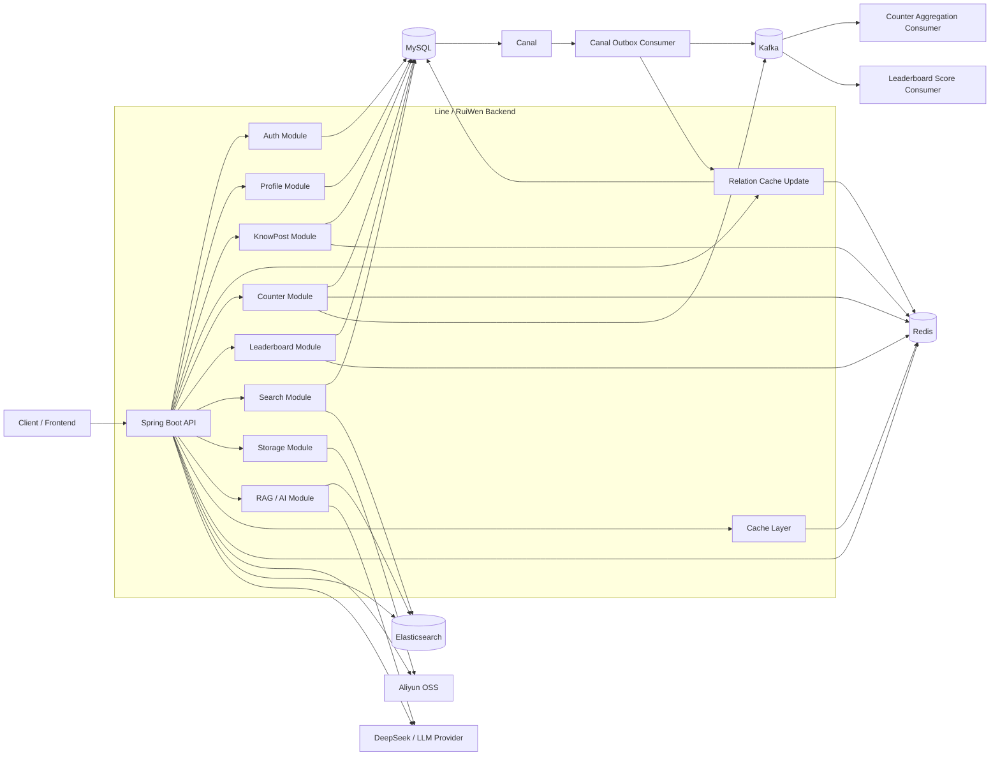
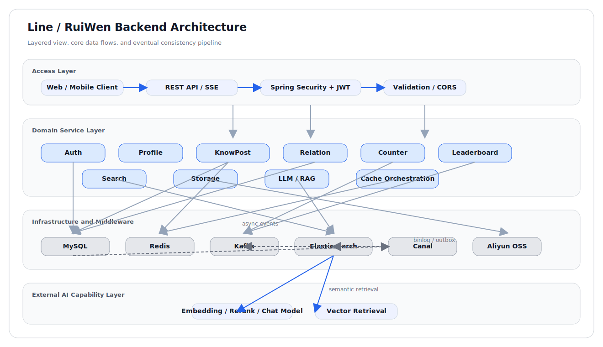

# Line

**Line** 是一个面向知识分享与社交互动的后端服务：基于 **Spring Boot 3** 与 **Spring AI**，提供用户认证、知文（帖子）创作与分发、关注关系、互动计数、全文检索与联想、排行榜，以及基于向量检索与重排序的 **RAG 问答**与 AI 辅助能力。数据层以 **MySQL** 为权威存储，通过 **Canal** 订阅 binlog 驱动 **Outbox** 消息，将关系、搜索索引等异步与外部系统对齐。

> 说明：仓库根目录 Maven 工程名为 `RuiWen`（`artifactId`、主类 `com.tongji.RuiWenApplication`、默认 JAR 名为 `RuiWen-1.0-SNAPSHOT.jar`），产品对外名称使用 **Line**。

---

## 功能概览

| 领域 | 说明 |
|------|------|
| **认证** | 手机/邮箱验证码、注册、密码或验证码登录、JWT（Access/Refresh，RS256）、登出、重置密码；登录审计；验证码发送限流（每日/间隔限制） |
| **个人资料** | 资料 PATCH、头像上传（阿里云 OSS 预签名直传） |
| **知文** | 草稿创建、内容上传确认、元数据更新（标题/标签/可见性/置顶）、发布/软删除；AI 描述建议（DeepSeek 生成，不超过 50 字） |
| **Feed** | 首页/我的/用户公开列表；三级缓存（Caffeine 本地 → Redis 页面 → Redis 分片缓存），单航班防击穿，热键动态 TTL 扩展 |
| **检索** | Elasticsearch 关键词搜索（multi_match + function_score 互动加权）、标签过滤、游标分页（search_after）；Completion 联想建议 |
| **RAG** | 单篇/全局流式问答（SSE）、混合检索（向量+BM25+RRF 融合）、语义缓存（7 天 TTL）、语义分块（Markdown 感知）、热点问答、手动重建向量索引；支持 Reranker 精排 |
| **关系** | 关注/取关（Redis Lua 令牌桶限流）、关系状态、关注/粉丝列表（ZSet + Caffeine 本地缓存）；大V用户 Top500 本地缓存；Canal Outbox 异步驱动 |
| **互动与计数** | 点赞/收藏（Redis 位图原子切换 + Kafka 聚合）、SDS 大端 32 位汇总、异常时基于位图分片重建、限流+指数退避防重建风暴 |
| **排行榜** | 按类型与日期的 Top 榜；Redis Sorted Set + 线段树 10,000 粗估查询；每日点赞分数变更 Kafka 消费 |
| **存储** | 阿里云 OSS PUT 预签名直传（10 分钟有效期），支持知文正文和图片两种场景 |

公开接口（无需登录）：认证相关路径、`/api/knowposts/feed`、知文详情 GET、`/api/knowposts/*/qa/stream`、`/api/knowposts/*/qa/hotquestion`、`/api/leaderboards/top` 等；其余默认需携带 JWT。详见 `com.tongji.auth.config.SecurityConfig`。

---

## 技术栈

| 类别 | 选型 |
|------|------|
| 语言与构建 | Java 21、Maven |
| 框架 | Spring Boot 3.2.4、Spring Web、Validation、Actuator |
| 安全 | Spring Security、OAuth2 Resource Server（JWT/RS256） |
| AI | Spring AI 1.0.3（OpenAI 兼容嵌入、DeepSeek Chat）、Elasticsearch Vector Store |
| 数据访问 | MyBatis 3、MySQL |
| 搜索 | Elasticsearch 9.x（Java API Client） |
| 缓存与分布式 | Redis、Caffeine；Redisson（分布式锁/限流/RateLimiter） |
| 消息 | Apache Kafka（计数聚合、排行榜分数变更） |
| 同步 | Alibaba Canal 客户端（Outbox 表 binlog 订阅） |
| 对象存储 | 阿里云 OSS |

---

## 架构要点（简图）



## 系统架构图



---

## 运行前置条件

本地或 Docker 中需就绪（端口与 `application.yml` 默认一致时可直连）：

| 服务 | 默认说明 |
|------|----------|
| MySQL 8 | 示例配置中 JDBC 端口常为 `3309`（映射）或容器内 `3306`；库名 `ruiwen`，需开启 binlog（ROW）供 Canal |
| Redis | `6379` |
| Kafka | 宿主机 `9092`；Docker 网络内 broker 常为 `kafka:29092` |
| Elasticsearch | 宿主机 `9201` 映射到容器 `9200`（以你本地 `application.yml` 为准） |
| Canal | `11111`，destination 与 `canal.destination` 一致 |

可选：`canal.enabled: false` 可关闭 Canal 相关逻辑（若你无需 Outbox 同步，需自行评估功能影响）。

---

## 配置说明

主配置：`src/main/resources/application.yml`。

**务必通过环境变量或私密配置管理敏感信息**，不要将真实 API Key、OSS 密钥、数据库密码提交到仓库。可参考根目录 `.env.example` 与 `README-Docker.md` 中的 Docker 环境变量方式。

| 配置域 | 含义 |
|--------|------|
| `spring.datasource.*` | MySQL 连接（HikariCP，50 最大连接） |
| `spring.data.redis.*` | Redis（Lettuce 连接池，100 最大活跃） |
| `spring.kafka.*` | Kafka 生产者/消费者（幂等生产者，手动 offset 提交） |
| `spring.elasticsearch.uris` | ES 地址 |
| `spring.ai.deepseek.*` | DeepSeek 聊天（`deepseek-v4-flash`，温度 0.8） |
| `spring.ai.openai.*` | DashScope 嵌入（`text-embedding-v4`，1536 维度） |
| `spring.ai.vectorstore.elasticsearch` | ES 向量索引配置 |
| `canal.*` | Canal Server 地址、账号、表过滤等 |
| `auth.jwt.*` | JWT 签发；密钥文件见 `classpath:keys/` |
| `oss.*` | 阿里云 OSS |
| `counter.*` | 计数重建：锁 TTL、限流参数、退避参数 |
| `leaderboard.*` | 排行榜：TopN 容量、线段树范围、分桶大小、去重 TTL |
| `cache.*` | 多级缓存：L1/L2 TTL/容量、热键窗口/分段/阈值/扩展秒数 |
| `rag.*` | RAG：分块参数（token size/overlap/mode）、检索 topK、RRF k 值、精排开关、Prompt 上限 |

**JWT 密钥**：在 `src/main/resources/keys/` 放置 RSA 密钥对 `private.pem`、`public.pem`（与 `auth.jwt` 配置一致）。

---

## 本地运行

1. 安装 **JDK 21**、**Maven 3.9+**，并启动上一节中的依赖服务。
2. 复制并填写配置；生成或放入 JWT 用 PEM 密钥。
3. 编译打包：

```bash
mvn clean package -DskipTests
```

4. 启动：

```bash
java -jar target/RuiWen-1.0-SNAPSHOT.jar
```

或在 IDE 中运行 `com.tongji.RuiWenApplication`。

5. 健康检查（若未关闭 Actuator）：

```bash
curl http://localhost:8080/actuator/health
```

默认 HTTP 端口：**8080**（`server.port`）。

---

## Docker

- **依赖栈**：`docs/docker-compose.yml`（MySQL、Redis、Kafka、Elasticsearch、Canal、Kafka UI 等）。
- **应用镜像**：根目录 `Dockerfile` 多阶段构建；`docker-compose.app.yml` 仅编排应用容器。

一键示例（PowerShell，详见 `README-Docker.md`）：

```powershell
Copy-Item .\.env.example .\.env
docker compose --env-file .\.env -f .\docs\docker-compose.yml -f .\docker-compose.app.yml up -d --build
```

容器网络内请使用 **`kafka:29092`** 连接 Kafka，而不是 `localhost:9092`。

---

## 代码模块

| 包 | 职责 |
|----|------|
| `auth` | 认证、JWT（RS256）、验证码（Redis 存储，支持阿里云/过龙/日志多通道）、安全配置、登录审计 |
| `profile` | 用户资料 PATCH、头像上传封装 |
| `knowpost` | 知文 API（草稿/发布/元数据/删除）、Feed 服务（三级缓存/单航班/热键 TTL）、AI 描述生成 |
| `search` | ES 关键词检索（function_score 加权）、游标分页（search_after）、Completion 联想建议 |
| `relation` | 关注服务（Lua 限流/ZSet 分页/Caffeine 本地缓存/Canal Outbox）、关系状态 |
| `counter` | 计数服务（Redis 位图原子切换/SDS 汇总/Kafka 聚合/位图分片重建/退避防风暴）、行为 API |
| `leaderboard` | 排行榜查询（Top 分页/用户排名/批量查询）、分数变更 Kafka 消费、线段树粗估 |
| `storage` | 阿里云 OSS 预签名 PUT URL 生成 |
| `llm` | 嵌入（DashScope text-embedding-v4）、RAG 混合检索（向量+BM25+RRF）、语义缓存、语义分块（Markdown 感知/LLM 增强）、精排（Reranker）、流式问答、Prompt 模板 |
| `cache` | 缓存配置（Caffeine L1 + Redis L2）、热键探测器（滑动窗口/热度分级/动态 TTL 扩展） |

**主要 API 前缀**：

| 前缀 | 说明 |
|------|------|
| `/api/auth` | 认证（注册/登录/登出/刷新/重置密码/发送验证码） |
| `/api/profile` | 资料编辑与头像上传 |
| `/api/knowposts` | 知文 CRUD、Feed、AI 描述、RAG 问答、热点问题、索引重建 |
| `/api/search` | 关键词检索、联想建议 |
| `/api/relation` | 关注/取关、关系状态、关注/粉丝列表 |
| `/api/counter` | 计数读取 |
| `/api/action` | 点赞/取消点赞、收藏/取消收藏 |
| `/api/leaderboards` | Top 榜、用户排名、批量排名查询 |
| `/api/storage` | OSS 预签名上传 URL |
| `/api/rag` | 全局 RAG 问答 |

---

## 核心设计说明

### Feed 三级缓存

公共 Feed 采用本地 Caffeine → Redis 页面缓存 → Redis 分片缓存三层结构：

- **本地 Caffeine**：进程内缓存，按 `page:size` Key 缓存完整 `FeedPageResponse`，读取最近被访问的 Key 动态延长 TTL（热键保护）。
- **Redis 页面缓存**：完整页面 JSON，TTL 10~20s（含随机抖动避免雪崩）。
- **Redis 分片缓存**：按小时分片缓存 ID 列表、知文条目、计数、hasMore 软缓存；TTL 60~90s。
- **单航班（Singleflight）**：同一 `idsKey` 的并发请求共用一把 synchronized 锁，避免击穿。
- **内容更新失效**：维护内容→页面的反向索引（Set），内容变更时精准失效受影响页面。

### 计数服务（位图 + SDS + Kafka 聚合）

- **位图（Bitmap）**：用户维度行为（点赞/收藏）以 `userId` 哈希分片写入 Redis 位图，`SETBIT` 原子切换，Lua 脚本确保幂等。
- **SDS 汇总**：计数快照以固定长度字节数组（`field_size=4`）大端存储，`AGG` 聚合增量每 1s 折叠到 SDS。
- **位图分片重建**：SDS 结构异常或采样校验失败时，以 Redis 分片位图的 `BITCOUNT` 求和重建，加 Redisson 分布式锁 + 限流 + 指数退避防止重建风暴。
- **Kafka 聚合**：计数事件按实体维度分区，保证同实体事件顺序。

### 关系服务（Outbox + ZSet + 大V缓存）

- **关注/取关**：事务入库后写入 Outbox 表（Canal 订阅），Outbox 消费者消费后更新粉丝表与 Redis ZSet。
- **Redis ZSet 分页**：关注/粉丝列表以 `userId` 为 Key、关注时间戳为分数，支持偏移分页与游标分页两种方式。
- **大V本地缓存**：粉丝数 ≥50 万的用户，在 Caffeine 缓存前 500 粉丝 ID，降低大V用户的冷启动回源。
- **Lua 令牌桶限流**：关注操作通过 Redis Lua 脚本实现令牌桶（100 容量/1 速率），防止刷关。

### RAG 问答（混合检索 + 语义缓存 + 流式生成）

完整链路：

1. **语义缓存检查**：将用户提问转为 1536 维向量，余弦相似度 >0.98 命中时直接返回缓存答案（7 天 TTL）。
2. **混合检索**：`text-embedding-v4` 向量检索 + ES BM25 关键词检索，各自召回 Top 20，通过 **RRF（Reciprocal Rank Fusion）** 融合排序。
3. **语义分块**（索引时）：Markdown 结构感知切分（`MarkdownBlockParser` + `MarkdownSectionMerger`），支持纯规则（rule）或 LLM 增强（llm）两种模式，默认 chunk_size=500 tokens、overlap=50 tokens。
4. **Prompt 组装**：将 Top N Chunk 注入 System/User Prompt，控制最终送入 LLM 的 Chunk 数量（默认 5）。
5. **流式生成**：DeepSeek `deepseek-v4-flash` 流式输出 SSE，答题过程中边收集片段、流结束后异步回写语义缓存。
6. **Reranker 精排**（可选）：RRF 后的候选送入 BGE-Reranker 等精排模型重排序。

### 热键探测器

滑动时间窗口分段计数器（`windowSeconds=60 / segmentSeconds=10`，共 6 段），按总热度映射到 NONE/LOW/MEDIUM/HIGH 四级，影响 Feed 页面缓存的动态 TTL 扩展秒数（LOW+20s、MEDIUM+60s、HIGH+120s）。

### Canal Outbox 模式

MySQL `outbox` 表记录关注/取关事件，Canal 订阅 binlog 将变更写入 Kafka，`CanalOutboxConsumer` 消费后交由 `RelationEventProcessor` 更新粉丝表与 Redis 缓存，保证关系数据最终一致性。

---

## 许可证与声明

若对外分发，请自行补充许可证条款。生产环境请关闭或保护 Actuator 敏感端点，收紧 CORS，并为所有第三方密钥使用密钥托管或环境注入。
