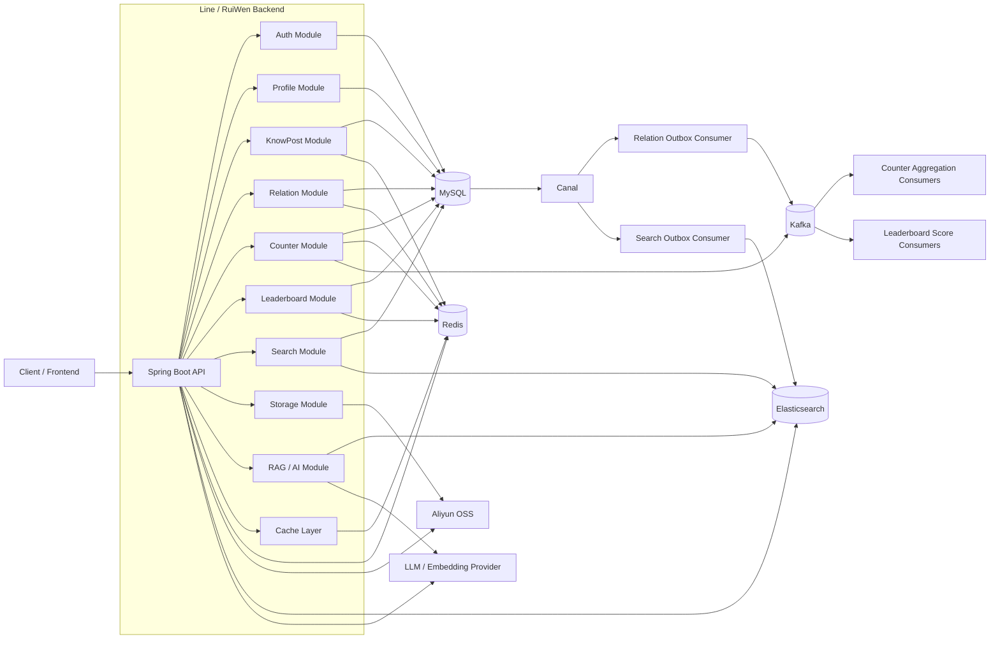

# Line

**Line** 是一个面向知识分享与社交互动的后端服务：基于 **Spring Boot 3** 与 **Spring AI**，提供用户认证、知文（帖子）创作与分发、关注关系、互动计数、全文检索与联想、排行榜，以及基于向量检索与重排序的 **RAG 问答**与 AI 辅助能力。数据层以 **MySQL** 为权威存储，通过 **Canal** 订阅 binlog 驱动 **Outbox** 消息，将关系、搜索索引等异步与外部系统对齐。

> 说明：仓库根目录 Maven 工程名为 `RuiWen`（`artifactId`、主类 `com.tongji.RuiWenApplication`、默认 JAR 名为 `RuiWen-1.0-SNAPSHOT.jar`），产品对外名称使用 **Line**。

---

## 功能概览

| 领域 | 说明                                                    |
|------|-------------------------------------------------------|
| **认证** | 手机/邮箱验证码、注册、密码或验证码登录、JWT（Access/Refresh）、登出、重置密码；登录审计 |
| **个人资料** | 资料 PATCH、头像上传（阿里云 OSS）                                |
| **知文** | 草稿、内容直传确认、元数据更新、Feed、详情；AI 描述建议                       |
| **检索** | Elasticsearch 关键词搜索、标签过滤、游标分页；Completion 联想建议         |
| **RAG** | 单篇知文流式问答（SSE）、热点问题、手动重建向量索引                           |
| **关系** | 关注/取关、关系状态、关注/粉丝列表；Redis 缓存与用户维度计数                    |
| **互动与计数** | 点赞/收藏等行为；按实体读取聚合计数（Kafka 异步与重建逻辑）                     |
| **排行榜** | 按类型与日期的 Top 榜、线段树10000粗估查询等                           |
| **存储** | OSS 预签名直传                                             |

公开接口（无需登录）包括：认证相关路径、`/api/knowposts/feed`、知文详情 GET、部分 RAG 只读接口、`/api/leaderboards/top` 等；其余默认需携带 JWT。详见 `com.tongji.auth.config.SecurityConfig`。

---

## 技术栈

| 类别 | 选型 |
|------|------|
| 语言与构建 | Java 21、Maven |
| 框架 | Spring Boot 3.2.4、Spring Web、Validation、Actuator |
| 安全 | Spring Security、OAuth2 Resource Server（JWT） |
| AI | Spring AI 1.0.x（OpenAI 兼容嵌入、DeepSeek 对话等）、Elasticsearch Vector Store |
| 数据访问 | MyBatis 3、MySQL |
| 搜索 | Elasticsearch 9.x（Java API Client） |
| 缓存与分布式 | Redis、Caffeine；Redisson（锁/限流等） |
| 消息 | Apache Kafka（计数与聚合等） |
| 同步 | Alibaba Canal 客户端（Outbox 表变更） |
| 对象存储 | 阿里云 OSS |

---

## 架构要点（简图）



- **Outbox**：业务写入 MySQL 的 outbox 表后，由 Canal 捕获变更，应用内消费者再投递 Kafka 或更新 ES 索引，实现最终一致。
- **计数**：行为写入经 Kafka 等路径聚合，支持重建与限流配置（见 `counter.*`）。
- **搜索与 RAG**：业务索引与 Spring AI 向量索引协同；RAG 使用嵌入、检索与重排序（见 `com.tongji.llm.rag`）。

---

## 运行前置条件

本地或 Docker 中需就绪（端口与 `application.yml` 默认一致时可直连）：

| 服务 | 默认说明 |
|------|----------|
| MySQL 8 | 示例配置中 JDBC 端口常为 `3309`（映射）或容器内 `3306`；库名 `ruiwen`，需开启 binlog（ROW）供 Canal |
| Redis | `6379` |
| Kafka | 宿主机 `9092`；Docker 网络内 broker 常为 `kafka:29092` |
| Elasticsearch | 宿主机 `9201` 映射到容器 `9200`（以你本地 `application.yml` 为准） |
| Canal | `11111`，destination 与 `canal.destination` 一致 |

可选：`canal.enabled: false` 可关闭 Canal 相关逻辑（若你无需 Outbox 同步，需自行评估功能影响）。

---

## 配置说明

主配置：`src/main/resources/application.yml`。

**务必通过环境变量或私密配置管理敏感信息**，不要将真实 API Key、OSS 密钥、数据库密码提交到仓库。可参考根目录 `.env.example` 与 `README-Docker.md` 中的 Docker 环境变量方式。

| 配置域 | 含义 |
|--------|------|
| `spring.datasource.*` | MySQL 连接 |
| `spring.data.redis.*` | Redis（可用 `REDIS_PASSWORD`） |
| `spring.kafka.*` | Kafka 生产者/消费者 |
| `spring.elasticsearch.uris` | ES 地址 |
| `spring.ai.*` | DeepSeek、OpenAI 兼容接口、向量维度与 ES 向量索引名 |
| `canal.*` | Canal Server 地址、账号、表过滤等 |
| `auth.jwt.*` | JWT 签发；密钥文件见 `classpath:keys/` |
| `oss.*` | 阿里云 OSS |
| `counter.*` / `leaderboard.*` / `cache.*` | 计数重建、排行榜与多级缓存参数 |

**JWT 密钥**：在 `src/main/resources/keys/` 放置 RSA 密钥对 `private.pem`、`public.pem`（与 `auth.jwt` 配置一致）。

---

## 本地运行

1. 安装 **JDK 21**、**Maven 3.9+**，并启动上一节中的依赖服务。
2. 复制并填写配置；生成或放入 JWT 用 PEM 密钥。
3. 编译打包：

```bash
mvn clean package -DskipTests
```

4. 启动：

```bash
java -jar target/RuiWen-1.0-SNAPSHOT.jar
```

或在 IDE 中运行 `com.tongji.RuiWenApplication`。

5. 健康检查（若未关闭 Actuator）：

```bash
curl http://localhost:8080/actuator/health
```

默认 HTTP 端口：**8080**（`server.port`）。

---

## Docker

- **依赖栈**：`docs/docker-compose.yml`（MySQL、Redis、Kafka、Elasticsearch、Canal、Kafka UI 等）。
- **应用镜像**：根目录 `Dockerfile` 多阶段构建；`docker-compose.app.yml` 仅编排应用容器。

一键示例（PowerShell，详见 `README-Docker.md`）：

```powershell
Copy-Item .\.env.example .\.env
docker compose --env-file .\.env -f .\docs\docker-compose.yml -f .\docker-compose.app.yml up -d --build
```

容器网络内请使用 **`kafka:29092`** 连接 Kafka，而不是 `localhost:9092`。

---

## 代码模块

| 包 | 职责 |
|----|------|
| `auth` | 认证、JWT、验证码、安全与全局异常 |
| `user` / `profile` | 用户与资料 |
| `knowpost` | 知文 API、Feed、AI 描述与 RAG 控制器 |
| `search` | 搜索服务与 Canal 驱动的索引消费 |
| `relation` | 关系服务与 Outbox / Canal 桥接 |
| `counter` | 计数、行为 API、Kafka 消费与重建 |
| `leaderboard` | 排行榜查询与分数变更消费 |
| `storage` | OSS 预签名与上传封装 |
| `llm` | 嵌入、RAG、重排序与对话编排 |
| `cache` | 缓存配置与策略 |

**主要 API 前缀**：`/api/auth`、`/api/profile`、`/api/knowposts`、`/api/search`、`/api/relation`、`/api/counter`、`/api/action`、`/api/leaderboards`、`/api/storage`。

---

## 许可证与声明

若对外分发，请自行补充许可证条款。生产环境请关闭或保护 Actuator 敏感端点，收紧 CORS，并为所有第三方密钥使用密钥托管或环境注入。
