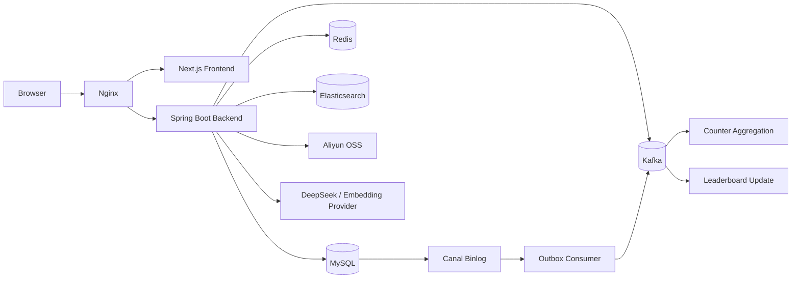

# RuiWen

RuiWen 是一个知识创作、社交互动与 RAG 问答平台。仓库现在按前后端分离组织：

- `backend/`：Spring Boot 3 后端，提供认证、知文、关注关系、互动计数、搜索、排行榜、OSS 上传和 RAG 问答能力。
- `frontend/`：Next.js 前端，提供登录注册、知识帖浏览与创作、问答、搜索、排行榜和个人资料页面。
- `deploy/`：MySQL、Redis、Kafka、Elasticsearch IK、Canal、Nginx 和部署 hook 的运行配置。
- `scripts/`：Docker 发布包构建、部署 hook 打包和签名上传脚本。

## 功能概览

| 模块 | 能力 |
| --- | --- |
| 认证 | 手机/邮箱验证码、注册、登录、刷新令牌、登出、重置密码、JWT RS256 鉴权和登录审计 |
| 用户资料 | 资料编辑、头像上传、OSS 预签名直传 |
| 知文 | 草稿创建、Markdown 内容编辑、发布、详情、Feed、可见性、置顶、软删除 |
| AI 与 RAG | 知文描述建议、单篇问答、全局问答、Markdown 语义切分、向量检索、BM25、RRF 融合、语义缓存和可选重排 |
| 搜索 | Elasticsearch 关键词搜索、标签过滤、游标分页和搜索建议 |
| 关注关系 | 关注/取关、关系状态、关注列表、粉丝列表、Redis 缓存与 Canal Outbox 同步 |
| 互动计数 | 点赞、收藏、Redis 位图、Kafka 聚合、异常重建和计数读取 |
| 排行榜 | 日榜/周榜/月榜等 Top 查询、用户排名、批量排名查询 |
| 部署 | 本地一键 Docker Compose、离线发布包、HMAC 签名部署 hook |

## 技术栈

| 层 | 技术 |
| --- | --- |
| 后端 | Java 21、Spring Boot 3.2、Spring Security、Spring AI、MyBatis、Maven |
| 前端 | Next.js 16、React 19、TypeScript、Tailwind CSS、Radix UI、lucide-react |
| 数据 | MySQL 8、Redis 7、Elasticsearch 9、Kafka、Canal |
| AI | DeepSeek Chat、OpenAI 兼容 Embedding、Elasticsearch Vector Store |
| 部署 | Docker、Docker Compose、Nginx、shell 发布脚本、Python deploy hook |

## 目录结构

```text
.
├── backend/                         # Spring Boot 后端工程
│   ├── Dockerfile
│   ├── pom.xml
│   └── src/main/
│       ├── java/com/tongji/         # 业务模块源码
│       └── resources/               # application.yml、mapper、JWT keys、RAG prompts
├── frontend/                        # Next.js 前端工程
│   ├── app/                         # App Router 页面
│   ├── components/                  # UI 与业务组件
│   ├── lib/                         # API client、类型与工具函数
│   └── public/                      # 静态资源
├── deploy/
│   ├── canal/                       # Canal instance 配置
│   ├── elasticsearch/               # IK 插件与词典
│   ├── hook/                        # 服务器部署 hook
│   ├── mysql/schema.sql             # MySQL 初始化结构
│   └── nginx/default.conf           # 前端与后端反向代理
├── scripts/                         # 打包、上传、部署脚本
├── docker-compose.yml               # 本地完整运行栈
├── .env.example                     # 本地 Docker 环境模板
├── .env.docker.example              # 服务器运行环境模板
└── DEPLOY_DOCKER.md                 # Docker 发布和 hook 部署说明
```

## 架构


```mermaid
flowchart LR
  Browser[Browser] --> Nginx[Nginx]
  Nginx --> Frontend[Next.js Frontend]
  Nginx --> Backend[Spring Boot Backend]

  Backend --> MySQL[(MySQL)]
  Backend --> Redis[(Redis)]
  Backend --> Kafka[(Kafka)]
  Backend --> ES[(Elasticsearch)]
  Backend --> OSS[Aliyun OSS]
  Backend --> LLM[DeepSeek / Embedding Provider]

  MySQL --> Canal[Canal Binlog]
  Canal --> Outbox[Outbox Consumer]
  Outbox --> Kafka
  Kafka --> Counter[Counter Aggregation]
  Kafka --> Leaderboard[Leaderboard Update]
```

后端主要模块位于 `backend/src/main/java/com/tongji`：

| 包 | 职责 |
| --- | --- |
| `auth` | 安全配置、JWT、验证码、注册登录、刷新令牌、登录审计 |
| `profile` | 用户资料与头像信息 |
| `knowpost` | 知文草稿、发布、详情、Feed、缓存失效与 AI 描述 |
| `llm` | RAG 检索、语义缓存、Embedding、Prompt、Markdown 切分和流式问答 |
| `search` | Elasticsearch 索引、搜索和建议 |
| `relation` | 关注关系、关系缓存、Outbox 事件处理 |
| `counter` | 点赞/收藏状态、计数聚合、位图重建 |
| `leaderboard` | 排行榜读写、批量排名和 Kafka 消费 |
| `storage` | OSS 预签名上传 |
| `cache` | Caffeine 与 Redis 缓存配置、热 key 探测 |

## 快速启动

推荐优先用 Docker Compose 跑完整环境。

```bash
cp .env.example .env
mkdir -p certs/nginx
# 将 line68.cn_bundle.crt 和 line68.cn.key 放入 certs/nginx/
docker compose --env-file .env up -d --build
```

默认入口：

| 服务 | 地址 |
| --- | --- |
| 前端 | `https://localhost` |
| 后端 | `http://localhost:8080` |
| MySQL | `127.0.0.1:3306` |
| Redis | `127.0.0.1:6379` |
| Kafka | `127.0.0.1:9092` |
| Elasticsearch | `http://127.0.0.1:9201` |

Nginx 配置会把 HTTP 重定向到 HTTPS，并要求以下证书文件存在：

```text
certs/nginx/line68.cn_bundle.crt
certs/nginx/line68.cn.key
```

本地仅调试前后端时，也可以跳过 Nginx，分别启动后端和前端开发服务。

## 本地开发

### 依赖服务

可以只启动基础依赖：

```bash
cp .env.example .env
docker compose --env-file .env up -d mysql redis kafka elasticsearch canal
```

Kafka UI 是可选工具：

```bash
docker compose --env-file .env --profile tools up -d kafka-ui
```

### 后端

```bash
cd backend
mvn spring-boot:run
```

常用配置来自 `backend/src/main/resources/application.yml`，并支持用环境变量覆盖。关键环境变量包括：

| 变量 | 说明 |
| --- | --- |
| `SPRING_DATASOURCE_URL`、`DB_USERNAME`、`DB_PASSWORD` | MySQL 连接 |
| `REDIS_HOST`、`REDIS_PORT`、`REDIS_PASSWORD` | Redis 连接 |
| `KAFKA_BOOTSTRAP_SERVERS` | Kafka 地址 |
| `ELASTICSEARCH_URIS` | Elasticsearch 地址 |
| `DEEPSEEK_API_KEY` | DeepSeek Chat API Key |
| `OPENAI_API_KEY`、`OPENAI_BASE_URL` | OpenAI 兼容 Embedding 服务 |
| `OSS_ACCESS_KEY_ID`、`OSS_ACCESS_KEY_SECRET`、`OSS_BUCKET` | 阿里云 OSS |
| `CANAL_ENABLED`、`CANAL_HOST`、`CANAL_DESTINATION` | Canal 同步 |

JWT 密钥默认读取：

```text
backend/src/main/resources/keys/private.pem
backend/src/main/resources/keys/public.pem
```

### 前端

```bash
cd frontend
npm install
NEXT_PUBLIC_API_BASE_URL=http://localhost:8080 npm run dev
```

开发服务默认地址：`http://localhost:3000`。

主要页面：

| 路径 | 页面 |
| --- | --- |
| `/login`、`/register`、`/reset-password` | 认证流程 |
| `/app` | 应用首页 |
| `/app/posts/create` | 知文创作 |
| `/app/posts/[id]` | 知文详情 |
| `/app/qa` | RAG 问答 |
| `/app/search` | 搜索 |
| `/app/leaderboard` | 排行榜 |
| `/app/profile`、`/app/profile/[userId]`、`/app/profile/edit` | 个人资料 |

## 常用命令

后端：

```bash
cd backend
mvn test
mvn clean package
```

前端：

```bash
cd frontend
npm run lint
npm run build
```

Docker：

```bash
docker compose --env-file .env ps
docker compose --env-file .env logs -f backend
docker compose --env-file .env logs -f frontend
docker compose --env-file .env down
```

## API 前缀

| 前缀 | 说明 |
| --- | --- |
| `/api/auth` | 注册、登录、刷新、登出、验证码、重置密码 |
| `/api/profile` | 用户资料 |
| `/api/knowposts` | 知文、Feed、AI 描述、单篇 RAG |
| `/api/rag` | 全局 RAG |
| `/api/search` | 搜索与建议 |
| `/api/relation` | 关注关系 |
| `/api/action` | 点赞、收藏等用户动作 |
| `/api/counter` | 计数读取 |
| `/api/leaderboards` | 排行榜 |
| `/api/storage` | OSS 预签名上传 |
| `/actuator` | Spring Boot 运行状态 |

鉴权规则由 `backend/src/main/java/com/tongji/auth/config/SecurityConfig.java` 控制。默认除公开认证、公开 Feed/详情、部分问答和排行榜接口外，其余接口需要携带 JWT。
