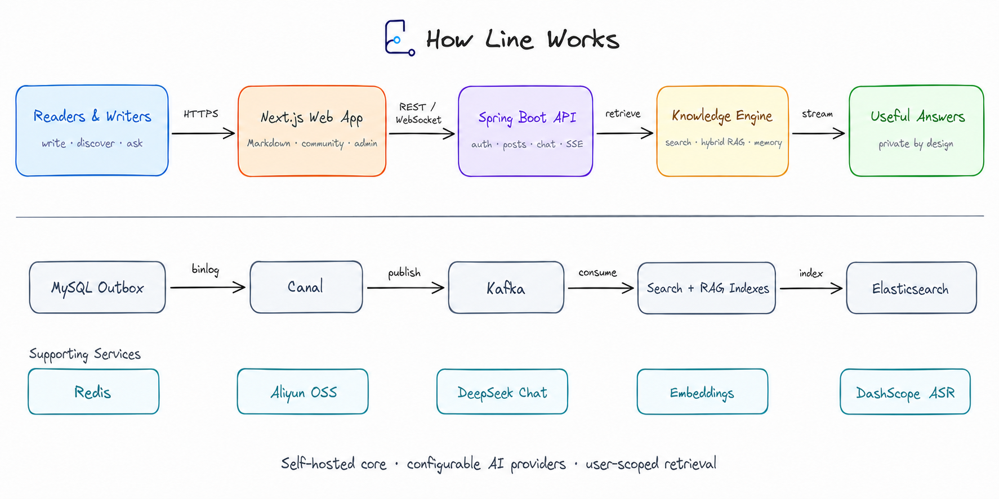
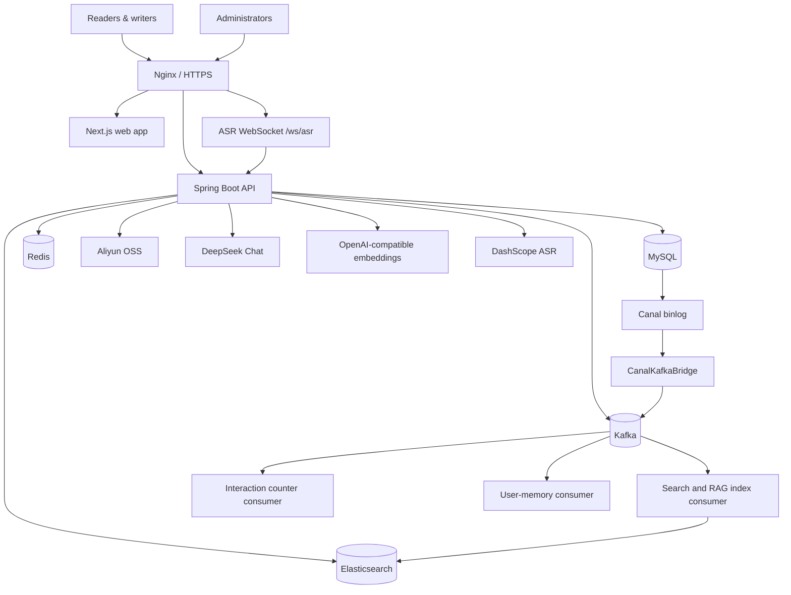
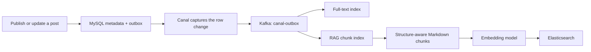
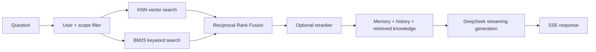

<div align="center">
  

  <h3>Write once. Discover together. Ask your knowledge.</h3>

  <p>
    <a href="#quick-start">Quick Start</a> ·
    <a href="#how-it-works">How It Works</a> ·
    <a href="#features">Features</a> ·
    <a href="#configuration">Configuration</a> ·
    <a href="#deployment">Deployment</a> ·
    <a href="#troubleshooting">Troubleshooting</a>
  </p>

  <p>
    
    
    
    
    <a href="./LICENSE"></a>
  </p>
</div>

Line is a self-hosted knowledge platform that brings a Markdown community, a private knowledge base, and a memory-aware AI assistant into one product.

Publish ideas for others to discover, keep private notes searchable only by you, and use retrieval-augmented conversations to turn everything you have written into useful answers.

> [!NOTE]
> The product name is **Line**. The repository path, Java application name, database name, Docker images, and some index names still use `RuiWen` or `ruiwen` for compatibility with existing data and deployments.



---

## Quick Start

The full stack runs with Docker Compose.

### Requirements

- Docker 24+
- Docker Compose v2
- At least 4 CPU cores and 8 GB of memory recommended
- API credentials for the AI or storage capabilities you plan to enable

### 1. Create your environment file

```bash
cp .env.example .env
```

At minimum, configure the providers you need:

```dotenv
DEEPSEEK_API_KEY=
OPENAI_API_KEY=

OSS_ACCESS_KEY_ID=
OSS_ACCESS_KEY_SECRET=
OSS_BUCKET=

# Required only for voice input
DASHSCOPE_ASR_API_KEY=
```

The example file contains development-only default passwords. Replace every MySQL, Redis, Canal, and deployment secret before using Line in production.

### 2. Add HTTPS certificates

The complete Compose stack exposes Line through Nginx and expects:

```text
certs/nginx/line68.cn_bundle.crt
certs/nginx/line68.cn.key
```

```bash
mkdir -p certs/nginx
```

For source-level frontend and backend development, you can skip Nginx and the certificates.

### 3. Validate and start

```bash
docker compose --env-file .env config
docker compose --env-file .env up -d --build
```

Check the stack:

```bash
docker compose --env-file .env ps
docker compose --env-file .env logs -f backend
```

| Service | Default address |
| --- | --- |
| Web | `https://localhost` |
| Backend API | `http://localhost:8080` |
| MySQL | `127.0.0.1:3306` |
| Redis | `127.0.0.1:6379` |
| Kafka | `127.0.0.1:9092` |
| Elasticsearch | `http://127.0.0.1:9201` |
| Kafka UI | `http://127.0.0.1:18080` |

Kafka UI is optional:

```bash
docker compose --env-file .env --profile tools up -d kafka-ui
```

---

## Why Line

Most knowledge tools make you choose between publishing, private retrieval, and AI assistance. Line keeps them in one loop:

| Write | Discover | Ask |
| --- | --- | --- |
| Compose Markdown in Monaco Editor, save drafts, publish selectively, and export posts as PDF. | Browse a public feed, follow writers, search by text and tags, and surface useful work through rankings. | Search public knowledge plus your own private library through hybrid RAG, then continue the answer in a remembered conversation. |

Public writing becomes community knowledge. Private writing remains user-scoped. Both can become context for the person who is allowed to retrieve them.

---

## How It Works

### Product architecture


```mermaid
flowchart TB
    User["Readers & writers"] --> Nginx["Nginx / HTTPS"]
    Admin["Administrators"] --> Nginx

    Nginx --> Frontend["Next.js web app"]
    Nginx --> Backend["Spring Boot API"]
    Nginx --> ASR["ASR WebSocket /ws/asr"]
    ASR --> Backend

    Backend --> MySQL[("MySQL")]
    Backend --> Redis[("Redis")]
    Backend --> Kafka[("Kafka")]
    Backend --> ES[("Elasticsearch")]
    Backend --> OSS["Aliyun OSS"]
    Backend --> Chat["DeepSeek Chat"]
    Backend --> Embedding["OpenAI-compatible embeddings"]
    Backend --> Speech["DashScope ASR"]

    MySQL --> Canal["Canal binlog"]
    Canal --> Bridge["CanalKafkaBridge"]
    Bridge --> Kafka
    Kafka --> SearchConsumer["Search and RAG index consumer"]
    Kafka --> CounterConsumer["Interaction counter consumer"]
    Kafka --> MemoryConsumer["User-memory consumer"]
    SearchConsumer --> ES
```

The application core is self-hosted: frontend, backend, data stores, cache, message broker, search engine, change-data capture, and reverse proxy all run in the Compose stack. Chat, embedding, speech, and object-storage providers are configured through environment variables.

### From Markdown to searchable knowledge


```mermaid
flowchart LR
    Publish["Publish or update a post"] --> DB["MySQL metadata + outbox"]
    DB --> Canal["Canal captures the row change"]
    Canal --> Topic["Kafka: canal-outbox"]
    Topic --> Search["Full-text index"]
    Topic --> RAG["RAG chunk index"]
    RAG --> Chunk["Structure-aware Markdown chunks"]
    Chunk --> Embed["Embedding model"]
    Embed --> ES["Elasticsearch"]
```

Indexing is incremental:

- New or updated posts refresh the full-text document and replace their previous RAG chunks.
- Deleted posts are soft-deleted from search and removed from the RAG index.
- Administrators can inspect index statistics and rebuild one post or the complete index.

### From a question to a streamed answer


```mermaid
flowchart LR
    Question["Question"] --> Access["User + scope filter"]
    Access --> Vector["KNN vector search"]
    Access --> BM25["BM25 keyword search"]
    Vector --> RRF["Reciprocal Rank Fusion"]
    BM25 --> RRF
    RRF --> Rerank["Optional reranker"]
    Rerank --> Prompt["Memory + history + retrieved knowledge"]
    Prompt --> LLM["DeepSeek streaming generation"]
    LLM --> SSE["SSE response"]
```

The retrieval filter is applied during search, not after results are returned:

| Scope | Retrievable content |
| --- | --- |
| `all` | Public posts plus non-public posts created by the current user |
| `private` | Only non-public posts created by the current user |

This keeps another user's private content outside the candidate result set.

---

## Features

| Area | What is included |
| --- | --- |
| Markdown authoring | Monaco Editor, GFM, syntax highlighting, drafts, publishing, editing, pinning, soft deletion, content fingerprints, PDF export, and AI-generated descriptions |
| Community | Public feed, profiles, following and followers, likes, favorites, interaction counts, and popularity rankings |
| Search | Elasticsearch full-text search, IK Chinese analysis, tag filters, suggestions, and cursor pagination |
| Private RAG | Structure-aware chunking, KNN vector search, BM25, RRF fusion, optional reranking, and query-time user isolation |
| AI conversations | Multi-turn chat, SSE streaming, saved conversations and messages, conversation rename/delete, retrieval context, and recent-history prompts |
| User memory | Manual memory management and AI summaries generated asynchronously from recent conversations through Kafka |
| Voice input | JWT-authenticated WebSocket relay to DashScope real-time ASR |
| Authentication | Email or phone registration, verification codes, password reset, JWT refresh, Google sign-in, and login auditing |
| Administration | User, role, post, visibility, conversation, memory, registration, settings, audit, and RAG-index management |
| Operations | Docker Compose, Nginx, health checks, Kafka UI profile, offline release bundles, and an HMAC-signed deployment hook |

---

## Technology Stack

| Layer | Technologies |
| --- | --- |
| Frontend | Next.js 16, React 19, TypeScript, Tailwind CSS 4, Radix UI, Monaco Editor, Framer Motion |
| Backend | Java 21, Spring Boot 3.2, Spring Security, Spring AI, MyBatis, Maven |
| AI | DeepSeek Chat, OpenAI-compatible embeddings, optional reranker, DashScope real-time ASR |
| Search and RAG | Elasticsearch 9, IK analysis, KNN, BM25, RRF |
| Data and cache | MySQL 8, Redis 7, Caffeine, Redisson |
| Async pipeline | Kafka, Canal, transactional outbox |
| File storage | Aliyun OSS with presigned uploads |
| Deployment | Docker, Docker Compose, Nginx, HMAC deployment hook |

---

## Repository Layout

```text
.
├── backend/                         # Spring Boot backend
│   ├── Dockerfile
│   ├── pom.xml
│   └── src/main/
│       ├── java/com/tongji/
│       │   ├── admin/               # Administration APIs and services
│       │   ├── asr/                 # Real-time speech WebSocket
│       │   ├── auth/                # Authentication, JWT, verification, audit
│       │   ├── counter/             # Likes, favorites, async counters
│       │   ├── knowpost/            # Posts, feed, cache, PDF export
│       │   ├── leaderboard/         # Rankings
│       │   ├── llm/                 # Chunking, embeddings, retrieval
│       │   ├── profile/             # User profiles
│       │   ├── qa/                  # Conversations and user memory
│       │   ├── relation/            # Follow graph and outbox
│       │   ├── search/              # Full-text search and index sync
│       │   └── storage/             # OSS presigned uploads
│       └── resources/
│           ├── application.yml
│           ├── mapper/
│           ├── qa-prompts/
│           └── keys/
├── frontend/                        # Next.js App Router frontend
│   ├── app/                         # Pages and routes
│   ├── components/                  # Product, Markdown, AI, and admin UI
│   ├── lib/                         # API clients, types, utilities
│   └── public/                      # Static and brand assets
├── deploy/
│   ├── canal/                       # Canal configuration
│   ├── elasticsearch/               # Elasticsearch IK plugin and dictionaries
│   ├── hook/                        # Automated deployment hook
│   ├── mysql/                       # Schema and migration SQL
│   ├── nginx/                       # HTTPS, API, and WebSocket proxy
│   └── docker-compose.runtime.yml   # Release runtime stack
├── docs/                            # README and architecture assets
├── scripts/                         # Packaging, deployment, and seed scripts
├── docker-compose.yml               # Complete local stack
├── .env.example                     # Local Docker configuration
├── .env.docker.example              # Server runtime configuration
├── .env.deploy.example              # Deployment-hook configuration
└── DEPLOY_DOCKER.md                 # Detailed deployment guide
```

---

## Local Development

### Start infrastructure

```bash
cp .env.example .env
docker compose --env-file .env up -d mysql redis kafka elasticsearch canal
```

### Start the backend

The backend's original default port is `58080`. Use `8080` locally to match the frontend and Docker configuration:

```bash
cd backend
SERVER_PORT=8080 mvn spring-boot:run
```

Maven does not automatically load AI, OSS, or ASR secrets from the root `.env` file. Export the required variables in your shell or add them to your IDE run configuration.

```bash
curl http://localhost:8080/actuator/health
```

### Start the frontend

```bash
cd frontend
npm install
NEXT_PUBLIC_API_BASE_URL=http://localhost:8080 npm run dev
```

Open `http://localhost:3000`.

---

## Configuration

### AI and RAG

| Variable | Purpose |
| --- | --- |
| `DEEPSEEK_API_KEY` | Chat and AI-summary credentials |
| `DEEPSEEK_BASE_URL` | Chat API endpoint |
| `DEEPSEEK_MODEL` | Chat model name |
| `OPENAI_API_KEY` | OpenAI-compatible embedding credentials |
| `OPENAI_BASE_URL` | Embedding API endpoint |
| `OPENAI_EMBEDDING_MODEL` | Embedding model name |
| `OPENAI_EMBEDDING_DIMENSIONS` | Embedding vector dimensions |
| `VECTORSTORE_INDEX_NAME` | Elasticsearch vector index |

`OPENAI_EMBEDDING_DIMENSIONS` must match the Elasticsearch vector index mapping. Rebuild the vector index after changing the embedding model or its dimensions.

### Data and middleware

| Variable | Purpose |
| --- | --- |
| `SPRING_DATASOURCE_URL`, `DB_USERNAME`, `DB_PASSWORD` | MySQL connection |
| `REDIS_HOST`, `REDIS_PORT`, `REDIS_PASSWORD` | Redis connection |
| `KAFKA_BOOTSTRAP_SERVERS` | Kafka brokers |
| `ELASTICSEARCH_URIS` | Elasticsearch endpoint |
| `CANAL_ENABLED`, `CANAL_HOST`, `CANAL_DESTINATION` | Canal synchronization |

The Canal username, password, destination, and filter must agree across the application configuration, Canal instance configuration, and MySQL initialization.

### Files, speech, and administration

| Variable | Purpose |
| --- | --- |
| `OSS_ENDPOINT`, `OSS_BUCKET` | OSS service and bucket |
| `OSS_ACCESS_KEY_ID`, `OSS_ACCESS_KEY_SECRET` | OSS credentials |
| `OSS_PUBLIC_DOMAIN` | Public file domain |
| `DASHSCOPE_ASR_API_KEY` | Real-time speech credentials |
| `ASR_WS_URL`, `ASR_MODEL` | Speech WebSocket and model |
| `ADMIN_BOOTSTRAP_ENABLED` | Enable the initial super-admin bootstrap |
| `ADMIN_BOOTSTRAP_IDENTIFIER` | Email or phone promoted at startup |

JWT uses the development RSA key pair at:

```text
backend/src/main/resources/keys/private.pem
backend/src/main/resources/keys/public.pem
```

Replace these keys and distribute the production pair securely.

---

## Application Routes

| Path | Page |
| --- | --- |
| `/login` | Sign in |
| `/register` | Create an account |
| `/reset-password` | Reset a password |
| `/app` | Community home |
| `/app/posts/create` | Markdown authoring |
| `/app/posts/[id]` | Post details |
| `/app/qa` | RAG chat and user memory |
| `/app/search` | Full-text search |
| `/app/leaderboard` | Rankings |
| `/app/profile` | Current-user profile |
| `/app/profile/[userId]` | Public user profile |
| `/admin` | Administration dashboard |
| `/admin/index` | RAG index management |
| `/admin/conversations` | AI conversation audit |
| `/admin/memories` | User-memory management |

### API groups

| Prefix | Capability |
| --- | --- |
| `/api/auth` | Registration, sign-in, refresh, sign-out, password reset |
| `/api/profile` | Profiles and avatars |
| `/api/knowposts` | Drafts, publishing, feed, details, AI descriptions, PDF, RAG rebuild |
| `/api/qa` | Streaming chat, conversations, user memory |
| `/api/search` | Search and suggestions |
| `/api/relation` | Follow relationships |
| `/api/action` | Like and favorite actions |
| `/api/counter` | Interaction counts |
| `/api/leaderboards` | Rankings |
| `/api/storage` | OSS presigned uploads |
| `/api/admin` | Administration |
| `/ws/asr` | JWT-authenticated real-time speech |
| `/actuator` | Health and runtime status |

Public feeds, public post details, public PDF exports, leaderboards, and selected authentication endpoints allow anonymous access. Other business APIs require JWT authentication. `/api/admin/**` requires an administrator role.

---

## Testing and Builds

Backend:

```bash
cd backend
mvn test
mvn clean package
```

Frontend:

```bash
cd frontend
npm run lint
npm run build
```

Compose validation:

```bash
docker compose --env-file .env config
```

---

## Deployment

See [DEPLOY_DOCKER.md](./DEPLOY_DOCKER.md) for the complete private-deployment workflow.

### Build an offline release

```bash
scripts/package_docker_release.sh 20260716
```

Artifacts:

```text
dist/docker-release/ruiwen-20260716/
dist/docker-release/ruiwen-release-20260716.tgz
```

Release bundles contain the frontend and backend Docker images plus runtime configuration. They exclude `.env`, `.env.docker`, `.env.deploy`, and other secret files.

### Deploy through the signed hook

```bash
cp .env.deploy.example .env.deploy
vim .env.deploy
scripts/deploy_release_hook.sh 20260716
```

Deployment requests use a timestamp, SHA-256 digest, and HMAC signature. The server-side hook verifies the signature and archive path, loads the images, and restarts the runtime stack with Docker Compose.

---

## Troubleshooting

### A published post is missing from search or RAG

Inspect the pipeline in order:

```text
MySQL outbox
  -> Canal
  -> CanalKafkaBridge
  -> Kafka canal-outbox
  -> search-index-consumer
  -> Elasticsearch full-text and RAG indexes
```

Also verify:

- The post status is `published`.
- The backend container can access the post's Markdown `contentUrl`.
- Canal credentials, instance name, and filter are consistent.
- The Kafka consumer is not continuously retrying or writing to `canal-outbox.DLT`.
- The embedding response dimensions match the vector index.

### Can another user retrieve my private posts?

No. Non-public posts may be represented in the vector index, but the search request filters by both `creatorId` and `visible`. Another user cannot retrieve them through either the `all` or `private` scope.

### Voice input cannot connect

- Set `DASHSCOPE_ASR_API_KEY`.
- Confirm Nginx proxies `/ws/asr` as a WebSocket connection.
- When the browser uses `wss://`, verify the HTTPS certificate.
- Send a valid JWT during the WebSocket handshake.

---

## License

Line is available under the [MIT License](./LICENSE).
