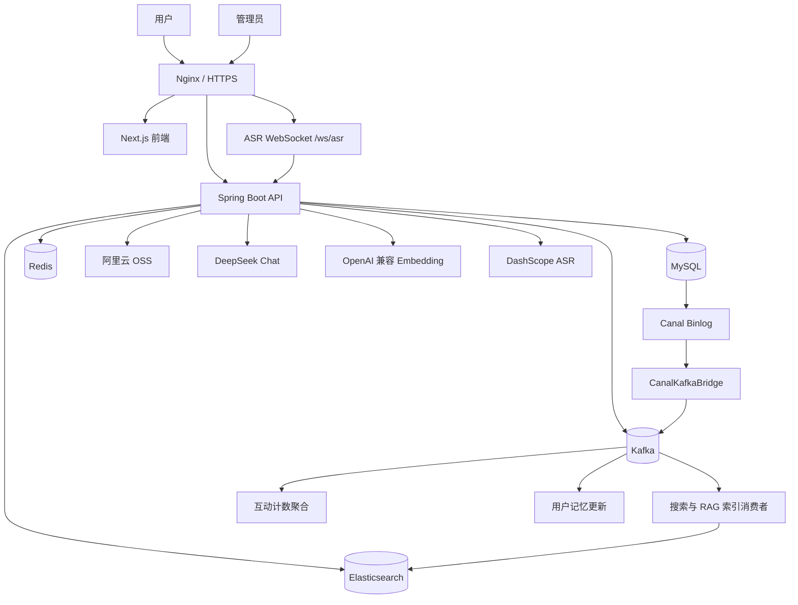
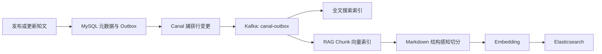
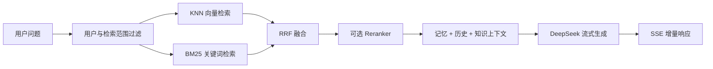

# Line

> 一个面向个人与社区的 Markdown 知识分享平台，让公开内容被发现，让私有知识可检索，让 AI 在持续对话中理解并帮助用户重新使用自己的知识。

Line 将知识社区、个人知识库与 AI 助手整合在同一个产品中。用户可以创作并发布 Markdown 知文，通过关注、点赞、收藏、搜索和排行榜发现优质内容；也可以保留仅自己可见的知识，并通过用户隔离的 RAG 检索与 AI 进行多轮问答。

项目的应用与数据基础设施支持私有化部署：前后端、数据库、缓存、消息队列、搜索引擎、增量同步和反向代理均可通过 Docker Compose 自托管；Chat、Embedding 与 ASR 服务则通过环境变量接入可配置的模型供应商。

> 项目的产品名称已经统一为 **Line**。仓库路径、Java 主类、数据库名、Docker 镜像名和部分索引名中仍保留 `RuiWen` / `ruiwen`，用于兼容现有数据与部署环境。

## Line 能做什么

### Markdown 知识创作

- 使用 Monaco Editor 编写 Markdown，支持 GFM、代码高亮和实时内容展示。
- 支持草稿、发布、编辑、置顶、软删除和 Markdown 内容指纹校验。
- 支持公开与私密知文，公开内容进入社区，非公开内容进入用户隔离的个人知识库。
- 支持将知文导出为 PDF。
- 支持 AI 生成知文描述，降低发布成本。

### 知识社区

- 公共 Feed、个人主页、关注与粉丝关系。
- 点赞、收藏、互动计数和热度排行榜。
- Elasticsearch 全文搜索、标签过滤、搜索建议和游标分页。
- 用户资料、头像上传、公开内容浏览和个人内容管理。

### 私有知识库 RAG

- 已发布的 Markdown 知文会进行结构感知切分并写入 Elasticsearch 向量索引。
- 同时执行向量检索与 BM25 关键词检索，再通过 RRF 融合排序。
- 支持可选 Reranker 精排。
- 检索阶段直接执行用户隔离，避免在结果返回后再做不可靠的应用层过滤。
- 问答范围支持：
  - `全部知识`：公共知识 + 当前用户自己的非公开知识。
  - `仅私有库`：只检索当前用户自己的非公开知识。

当前 RAG 隔离规则如下：

| 范围 | 可检索内容 |
| --- | --- |
| `all` | `visible=public` 的公共内容，以及 `creatorId=当前用户` 的非公开内容 |
| `private` | 仅 `creatorId=当前用户` 且 `visible!=public` 的内容 |

### AI 对话与用户记忆

- 基于 RAG 上下文的多轮流式问答，使用 SSE 返回增量内容。
- 保存会话与消息，支持会话创建、重命名、历史查看和删除。
- 将最近对话、用户记忆、检索上下文与当前问题统一组装进 Prompt。
- 用户可手动维护记忆，也可以让 AI 从近期对话中自动总结记忆。
- 达到消息阈值后，通过 Kafka 异步触发记忆更新。
- 支持实时语音转文字，通过 WebSocket 接入 DashScope ASR。

### 管理与运维

- 用户、角色、状态和密码重置管理。
- 知文可见性、置顶和删除管理。
- AI 会话、消息与用户记忆审计。
- RAG 索引统计、单篇重建、删除和全量重建。
- 注册策略、系统配置和登录日志管理。
- HMAC 签名部署 Hook，支持打包、上传、校验并自动重启服务。

## 产品架构


```mermaid
flowchart TB
    User["用户"] --> Nginx["Nginx / HTTPS"]
    Admin["管理员"] --> Nginx

    Nginx --> Frontend["Next.js 前端"]
    Nginx --> Backend["Spring Boot API"]
    Nginx --> ASR["ASR WebSocket /ws/asr"]
    ASR --> Backend

    Backend --> MySQL[("MySQL")]
    Backend --> Redis[("Redis")]
    Backend --> Kafka[("Kafka")]
    Backend --> ES[("Elasticsearch")]
    Backend --> OSS["阿里云 OSS"]
    Backend --> ChatModel["DeepSeek Chat"]
    Backend --> Embedding["OpenAI 兼容 Embedding"]
    Backend --> DashScope["DashScope ASR"]

    MySQL --> Canal["Canal Binlog"]
    Canal --> Bridge["CanalKafkaBridge"]
    Bridge --> Kafka
    Kafka --> SearchConsumer["搜索与 RAG 索引消费者"]
    SearchConsumer --> ES
    Kafka --> CounterConsumer["互动计数聚合"]
    Kafka --> MemoryConsumer["用户记忆更新"]
```

### 内容进入检索系统的流程


```mermaid
flowchart LR
    Publish["发布或更新知文"] --> DB["MySQL 元数据与 Outbox"]
    DB --> Canal["Canal 捕获行变更"]
    Canal --> Topic["Kafka: canal-outbox"]
    Topic --> SearchIndex["全文搜索索引"]
    Topic --> RagIndex["RAG Chunk 向量索引"]
    RagIndex --> Chunk["Markdown 结构感知切分"]
    Chunk --> Embed["Embedding"]
    Embed --> ES["Elasticsearch"]
```

索引消费者采用增量更新方式：

- 新建或更新知文：更新全文搜索索引，并删除旧 RAG Chunk 后重新构建。
- 删除知文：软删除搜索文档，并清理对应 RAG Chunk。
- 管理后台可查看索引统计，也可手动执行单篇或全量重建。

### RAG 问答流程


```mermaid
flowchart LR
    Question["用户问题"] --> Scope["用户与检索范围过滤"]
    Scope --> Vector["KNN 向量检索"]
    Scope --> BM25["BM25 关键词检索"]
    Vector --> RRF["RRF 融合"]
    BM25 --> RRF
    RRF --> Rerank["可选 Reranker"]
    Rerank --> Prompt["记忆 + 历史 + 知识上下文"]
    Prompt --> LLM["DeepSeek 流式生成"]
    LLM --> SSE["SSE 增量响应"]
```

## 技术栈

| 层 | 技术 |
| --- | --- |
| 前端 | Next.js 16、React 19、TypeScript、Tailwind CSS 4、Radix UI、Monaco Editor、Framer Motion |
| 后端 | Java 21、Spring Boot 3.2、Spring Security、Spring AI、MyBatis、Maven |
| AI | DeepSeek Chat、OpenAI 兼容 Embedding、DashScope 实时 ASR |
| 搜索与 RAG | Elasticsearch 9、IK 中文分词、KNN、BM25、RRF、可选 Reranker |
| 数据与缓存 | MySQL 8、Redis 7、Caffeine、Redisson |
| 异步链路 | Kafka、Canal、Transactional Outbox |
| 文件存储 | 阿里云 OSS 预签名直传 |
| 部署 | Docker、Docker Compose、Nginx、HMAC Deploy Hook |

## 仓库结构

```text
.
├── backend/                         # Spring Boot 后端
│   ├── Dockerfile
│   ├── pom.xml
│   └── src/main/
│       ├── java/com/tongji/
│       │   ├── admin/               # 管理后台 API 与服务
│       │   ├── asr/                 # 实时语音转文字 WebSocket
│       │   ├── auth/                # 认证、JWT、验证码与登录审计
│       │   ├── counter/             # 点赞、收藏与异步计数
│       │   ├── knowpost/            # 知文、Feed、缓存与 PDF 导出
│       │   ├── leaderboard/         # 排行榜
│       │   ├── llm/                 # Markdown 切分、Embedding 与 RAG
│       │   ├── profile/             # 用户资料
│       │   ├── qa/                  # 多轮问答、会话与用户记忆
│       │   ├── relation/            # 关注关系与 Outbox
│       │   ├── search/              # 全文搜索与索引同步
│       │   └── storage/             # OSS 预签名上传
│       └── resources/
│           ├── application.yml
│           ├── mapper/
│           ├── qa-prompts/
│           └── keys/
├── frontend/                        # Next.js App Router 前端
│   ├── app/                         # 页面与路由
│   ├── components/                  # 页面组件、Markdown、AI 与管理组件
│   ├── lib/                         # API Client、类型与工具
│   └── public/                      # 静态资源
├── deploy/
│   ├── canal/                       # Canal 配置
│   ├── elasticsearch/               # Elasticsearch IK 插件与词典
│   ├── hook/                        # 自动部署 Hook
│   ├── mysql/                       # 初始化结构与迁移 SQL
│   ├── nginx/                       # HTTPS、API 与 WebSocket 反向代理
│   └── docker-compose.runtime.yml   # 发布包运行编排
├── scripts/                         # 发布打包、Hook 部署与测试数据脚本
├── docker-compose.yml               # 本地完整运行栈
├── .env.example                     # 本地 Docker 配置模板
├── .env.docker.example              # 服务器运行配置模板
├── .env.deploy.example              # Hook 上传配置模板
└── DEPLOY_DOCKER.md                 # 详细部署说明
```

## 快速开始

### 环境要求

- Docker 24+ 与 Docker Compose v2
- 建议至少 4 核 CPU、8 GB 内存
- 如需本地源码开发：
  - Java 21
  - Maven 3.9+
  - Node.js 20+
  - npm

### 1. 准备配置

```bash
cp .env.example .env
```

至少需要根据实际环境填写以下配置：

```dotenv
DEEPSEEK_API_KEY=
OPENAI_API_KEY=

OSS_ACCESS_KEY_ID=
OSS_ACCESS_KEY_SECRET=
OSS_BUCKET=

# 使用语音输入时填写
DASHSCOPE_ASR_API_KEY=
```

示例配置中包含仅供开发使用的默认密码。生产部署前必须替换 MySQL、Redis、Canal、部署 Hook 等全部密钥和密码。

### 2. 准备 HTTPS 证书

完整 Compose 默认通过 Nginx 暴露 HTTPS，需要准备：

```text
certs/nginx/line68.cn_bundle.crt
certs/nginx/line68.cn.key
```

```bash
mkdir -p certs/nginx
```

将证书文件放入该目录。若只进行前后端源码调试，可以跳过 Nginx 和证书，按“本地开发”章节分别启动服务。

### 3. 校验并启动

```bash
docker compose --env-file .env config
docker compose --env-file .env up -d --build
```

查看运行状态：

```bash
docker compose --env-file .env ps
docker compose --env-file .env logs -f backend
```

默认地址：

| 服务 | 地址 |
| --- | --- |
| Web | `https://localhost` |
| Backend | `http://localhost:8080` |
| MySQL | `127.0.0.1:3306` |
| Redis | `127.0.0.1:6379` |
| Kafka | `127.0.0.1:9092` |
| Elasticsearch | `http://127.0.0.1:9201` |
| Kafka UI | `http://127.0.0.1:18080` |

Kafka UI 默认不启动，可按需启用：

```bash
docker compose --env-file .env --profile tools up -d kafka-ui
```

## 本地开发

### 启动基础依赖

```bash
cp .env.example .env
docker compose --env-file .env up -d mysql redis kafka elasticsearch canal
```

### 启动后端

后端原始默认端口为 `58080`。为了与前端开发配置和 Docker 环境保持一致，建议本地显式使用 `8080`：

```bash
cd backend
SERVER_PORT=8080 mvn spring-boot:run
```

AI、OSS、ASR 等敏感配置不会由 Maven 自动读取根目录 `.env`，请在当前终端导出需要的环境变量，或在 IDE Run Configuration 中配置。

后端检查：

```bash
curl http://localhost:8080/actuator/health
```

### 启动前端

```bash
cd frontend
npm install
NEXT_PUBLIC_API_BASE_URL=http://localhost:8080 npm run dev
```

前端开发地址为 `http://localhost:3000`。

## 关键配置

### AI 与 RAG

| 环境变量 | 说明 |
| --- | --- |
| `DEEPSEEK_API_KEY` | 对话与 AI 总结使用的模型密钥 |
| `DEEPSEEK_BASE_URL` | DeepSeek API 地址 |
| `DEEPSEEK_MODEL` | Chat 模型名称 |
| `OPENAI_API_KEY` | OpenAI 兼容 Embedding 服务密钥 |
| `OPENAI_BASE_URL` | Embedding 服务地址 |
| `OPENAI_EMBEDDING_MODEL` | Embedding 模型 |
| `OPENAI_EMBEDDING_DIMENSIONS` | 向量维度 |
| `VECTORSTORE_INDEX_NAME` | RAG 向量索引名 |

`OPENAI_EMBEDDING_DIMENSIONS` 必须与 Elasticsearch Vector Store 的索引维度一致。更换 Embedding 模型或维度后，需要重建对应向量索引。

### 数据与中间件

| 环境变量 | 说明 |
| --- | --- |
| `SPRING_DATASOURCE_URL`、`DB_USERNAME`、`DB_PASSWORD` | MySQL 连接 |
| `REDIS_HOST`、`REDIS_PORT`、`REDIS_PASSWORD` | Redis 连接 |
| `KAFKA_BOOTSTRAP_SERVERS` | Kafka Broker |
| `ELASTICSEARCH_URIS` | Elasticsearch 地址 |
| `CANAL_ENABLED`、`CANAL_HOST`、`CANAL_DESTINATION` | Canal 同步 |

Canal 的用户名、密码、目标实例和过滤表达式需要在应用配置、Canal 实例配置和 MySQL 初始化配置中保持一致。

### 文件、语音与管理员

| 环境变量 | 说明 |
| --- | --- |
| `OSS_ENDPOINT`、`OSS_BUCKET` | OSS 服务与 Bucket |
| `OSS_ACCESS_KEY_ID`、`OSS_ACCESS_KEY_SECRET` | OSS 访问密钥 |
| `OSS_PUBLIC_DOMAIN` | 文件公开访问域名 |
| `DASHSCOPE_ASR_API_KEY` | 实时语音识别密钥 |
| `ASR_WS_URL`、`ASR_MODEL` | ASR WebSocket 地址与模型 |
| `ADMIN_BOOTSTRAP_ENABLED` | 是否启用首个超级管理员引导 |
| `ADMIN_BOOTSTRAP_IDENTIFIER` | 启动时提升为超级管理员的邮箱或手机号 |

JWT 默认从以下位置读取 RSA 密钥：

```text
backend/src/main/resources/keys/private.pem
backend/src/main/resources/keys/public.pem
```

生产环境应替换仓库中的开发密钥，并通过安全方式分发。

## 页面入口

| 路径 | 页面 |
| --- | --- |
| `/login` | 登录 |
| `/register` | 注册 |
| `/reset-password` | 重置密码 |
| `/app` | 知识社区首页 |
| `/app/posts/create` | Markdown 知文创作 |
| `/app/posts/[id]` | 知文详情 |
| `/app/qa` | RAG 多轮问答与用户记忆 |
| `/app/search` | 全文搜索 |
| `/app/leaderboard` | 排行榜 |
| `/app/profile` | 当前用户主页 |
| `/app/profile/[userId]` | 用户公开主页 |
| `/admin` | 管理后台 |
| `/admin/index` | RAG 索引管理 |
| `/admin/conversations` | AI 会话审计 |
| `/admin/memories` | 用户记忆管理 |

## API 分组

| 前缀 | 能力 |
| --- | --- |
| `/api/auth` | 注册、登录、令牌刷新、登出与密码重置 |
| `/api/profile` | 用户资料与头像 |
| `/api/knowposts` | 草稿、发布、Feed、详情、AI 描述、PDF 和 RAG 重建 |
| `/api/qa` | 流式问答、会话与用户记忆 |
| `/api/search` | 全文搜索与建议 |
| `/api/relation` | 关注关系 |
| `/api/action` | 点赞与收藏动作 |
| `/api/counter` | 互动计数 |
| `/api/leaderboards` | 排行榜 |
| `/api/storage` | OSS 预签名上传 |
| `/api/admin` | 管理后台 |
| `/ws/asr` | JWT 鉴权的实时语音识别 WebSocket |
| `/actuator` | 健康检查与运行状态 |

公开 Feed、公开知文详情、公开知文 PDF、排行榜和部分认证接口允许匿名访问；其他业务接口默认需要 JWT。`/api/admin/**` 仅允许管理员角色访问。

## 测试与构建

后端：

```bash
cd backend
mvn test
mvn clean package
```

前端：

```bash
cd frontend
npm run lint
npm run build
```

完整 Compose 配置检查：

```bash
docker compose --env-file .env config
```

## 发布与私有化部署

详细流程见 [DEPLOY_DOCKER.md](./DEPLOY_DOCKER.md)。

### 构建离线发布包

```bash
scripts/package_docker_release.sh 20260716
```

产物：

```text
dist/docker-release/ruiwen-20260716/
dist/docker-release/ruiwen-release-20260716.tgz
```

发布包包含前后端 Docker 镜像与运行配置，不包含 `.env`、`.env.docker`、`.env.deploy` 等私密文件。

### 通过部署 Hook 发布

```bash
cp .env.deploy.example .env.deploy
vim .env.deploy
scripts/deploy_release_hook.sh 20260716
```

部署请求使用时间戳、SHA-256 与 HMAC 签名。服务端 Hook 会校验签名与压缩包路径安全，加载镜像并通过 Docker Compose 重启运行栈。

## 常见问题

### 新发布的知文没有进入搜索或 RAG

按以下链路逐段检查：

```text
MySQL outbox
  -> Canal
  -> CanalKafkaBridge
  -> Kafka canal-outbox
  -> search-index-consumer
  -> Elasticsearch 全文索引与 RAG 向量索引
```

同时确认：

- 知文状态已经是 `published`。
- 后端容器能够访问知文的 Markdown `contentUrl`。
- Canal 的账号、密码、实例名和过滤规则一致。
- Kafka 消费者没有持续重试或进入 `canal-outbox.DLT`。
- Embedding 模型返回的维度与向量索引一致。

### 私密知文是否会被其他用户的 RAG 检索到

不会。非公开知文虽然会进入向量索引，但检索时会同时过滤 `creatorId` 和 `visible`。其他用户无法通过 `all` 或 `private` 范围召回该内容。

### 语音输入无法连接

- 确认已配置 `DASHSCOPE_ASR_API_KEY`。
- 生产环境确认 Nginx 已将 `/ws/asr` 作为 WebSocket 转发到后端。
- 浏览器通过 `wss://` 访问时，检查 HTTPS 证书是否有效。
- WebSocket 握手需要有效 JWT。

## License

本项目基于 [MIT License](./LICENSE) 开源。
